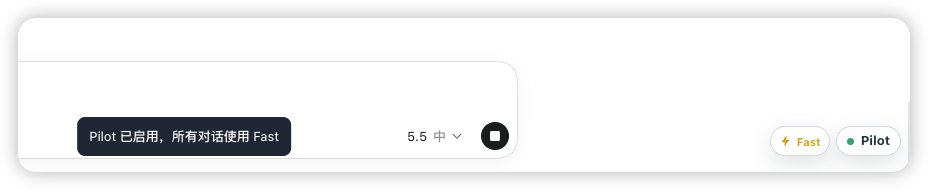
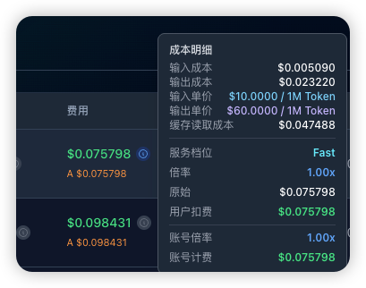

  

<h1 align="center">CodexPilot</h1>

  Make local Codex workflows smoother and more controllable.

  <a href="README.md">简体中文</a> · <a href="README.en.md">English</a>

  
  
  
  
  

CodexPilot is for people who already use Codex App locally. It provides a local manager and connects to running Codex pages through Chromium DevTools Protocol. Use it to launch Codex, unlock plugin entry, export sessions, manage the recycle bin, run dialog sync, and inspect diagnostics, without modifying Codex App's installed files or replacing the app.

> CodexPilot is unofficial and is not affiliated with OpenAI or Codex App.

## Quick Start

1. Open [GitHub Releases](https://github.com/hl9565/CodexPilot/releases) and download the package for your platform from the Assets section. Do not use the Source code archive as an installer.
   - Windows: download `CodexPilot-*-windows-x64-setup.exe` and run the installer.
   - macOS Apple Silicon: if the release provides `CodexPilot-*-macos-arm64.dmg`, open it and drag `CodexPilot.app` into Applications.
2. Open the CodexPilot manager, go to Launch, confirm the Codex path, and click Launch.
3. After Codex opens, use the CodexPilot menu to export the current session, or use the Fast control in the Pilot pill to choose the service tier.
4. To maintain historical sessions, use Dialog Maintenance for recycle bin cleanup or to run Dialog Sync.

Current macOS packages are not signed with an Apple Developer ID and are not notarized. If macOS cannot verify the app, read the note inside the DMG before using the bundled helper script.

macOS Intel builds are not currently published as verified release assets. If you use an Intel Mac, build and verify it from source.

## Highlights

### Plugin Unlock Without Login

The Launch page includes `Plugin Entry Unlock` and `Force Plugin Install` under Page Enhancements. When you use API-key mode without ChatGPT login, CodexPilot can unlock the native plugin entry inside Codex and re-enable install buttons that were disabled by `App unavailable`.

This only changes the current running Codex page. It does not take over Provider switching, and it does not require a CodexPilot-managed Provider flow in `~/.codex/config.toml`.

After unlock succeeds, the native Codex sidebar shows `Plugins - Unlocked` directly.

### Global Fast And Per-Dialog Fast

The Launch page includes `Global Fast` under Page Enhancements, and it is enabled by default. When enabled, CodexPilot rewrites all dialog requests to the Fast (`priority`) service tier, which fits workflows where lower waiting time should be the default.

When `Global Fast` is off, use the lightning button in the Pilot pill at the bottom-right of the Codex page to switch the current dialog between Fast and Standard. On a new-dialog page, enabling Fast before sending the first message makes that new dialog start in Fast from its first request. The cost detail popover also shows the active service tier and multiplier, so you can confirm the request actually used Fast.

### Dialog Sync

After ccSwitch or another tool changes `model_provider` in `~/.codex/config.toml`, historical sessions may disappear or group incorrectly because their Provider metadata no longer matches. CodexPilot does not rewrite historical data automatically; in Dialog Maintenance, you can preview the impact first, then manually sync session ownership to the current config provider or a manually entered Provider.

## Other Features

- Launch
- Page enhancement switches
- Global Fast and per-dialog Fast
- Session export
- Timeline
- Dialog maintenance
- Archived session handling
- Diagnostics snapshots

See [docs/features.en.md](docs/features.en.md) for the full feature guide.

## Local Data And Security

CodexPilot reads the current Provider from your local `~/.codex/config.toml` and reads or writes sessions, archived sessions, state databases, and backup directories under `~/.codex`.

Use CodexPilot only on trusted devices, and avoid uploading local config, logs, screenshots, or backup directories to public repositories. Model Provider switching and API key management should be handled by ccSwitch or your own Codex configuration flow.

See the [feature guide](docs/features.en.md#local-data-and-security) for the full data scope.

## Docs

- [Feature guide](docs/features.en.md): launch, dialog maintenance, dialog sync, diagnostics, and local data.
- [README guidelines](docs/development/readme-guidelines.md): homepage information architecture and copy rules, currently in Chinese.

## Support

For usage questions, feedback, and release updates, you can join the WeChat group.

This project links back to and recognizes the [LINUX DO](https://linux.do/) community. Feedback, usage notes, and improvement ideas are welcome in the community discussion thread.

## License

MIT
