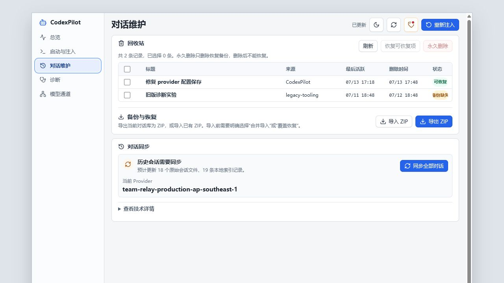

# CodexPilot 功能说明

这里解释 CodexPilot 每个页面能做什么、会读写哪些本地数据，以及哪些操作需要先预览影响范围。README 只保留首页和快速入口；完整功能说明放在这里维护。

## 目录

- [启动与注入](#启动与注入)
- [会话导出与维护](#会话导出与维护)
- [Timeline](#timeline)
- [对话同步](#对话同步)
- [诊断](#诊断)
- [本地数据与安全](#本地数据与安全)
- [兼容性说明](#兼容性说明)

## 启动与注入

CodexPilot 使用本地 launcher 启动 Codex，并通过 Chromium DevTools Protocol 连接页面。注入成功后，Codex 页面会出现 CodexPilot 操作菜单。

如果 Codex 已经由其他方式启动，管理器会根据当前状态提示重新注入或重启。重启 Codex 前会要求确认，避免未保存输入意外丢失。

启动页还提供一组“页面增强”开关，用来控制注入到 Codex 页面的可见能力：

- Timeline。
- 行内导出和删除。
- 滚动恢复。
- 插件入口解锁。
- 特殊插件强制安装。

其中“插件入口解锁”适合未登录 ChatGPT、只使用 API Key 模式的场景。打开后，CodexPilot 会在当前页面里解锁原生插件入口。“特殊插件强制安装”则会解除部分插件因 `App unavailable` / `应用不可用` 导致的安装按钮禁用。

这些增强只作用于当前页面注入效果，不会替代 ccSwitch，也不会接管 `~/.codex/config.toml` 的 Provider 切换或 API Key 管理。


如果插件入口解锁生效，Codex 原生侧栏会显示“插件 - 已解锁”。


## 会话导出与维护

CodexPilot 可以在普通会话和归档会话中提供额外操作：

- 导出 Markdown。
- 删除会话。
- 短时撤销删除。
- 查看、恢复或永久清理回收站中的删除备份。
- 批量删除归档会话。

删除和恢复操作会读写本机 Codex 的会话数据库。CodexPilot 会尽量保留可恢复备份，但仍建议在批量清理前确认会话内容已经不再需要。



## Timeline

在当前 Codex 对话中，如果检测到至少两个用户提问，CodexPilot 会在页面右侧显示一条轻量 Timeline。每个圆点代表一个用户提问，悬停可以查看问题摘要，点击会把对应提问滚动到屏幕中间。

Timeline 只读取当前页面内容，不写入会话文件、状态数据库或配置文件。如果当前页面不是对话页、无法识别会话，或用户提问数量不足，Timeline 会自动隐藏。

## 对话同步

ccSwitch 或其他工具切换 `~/.codex/config.toml` 里的 `model_provider` 后，历史会话可能因为 `model_provider` 不一致而不可见或分组异常。如需整理历史数据，进入管理器“对话维护”页，点击“同步全部对话”。CodexPilot 会在执行时自动读取当前配置的 Provider，并把本机普通与归档历史会话统一到该 Provider；无需选择目标、预览影响或再次确认。

同步仍是用户手动触发的维护操作，不会因切换 Provider、保存配置、启动宿主或刷新页面而在后台自动运行。每次切换 Provider 后，如需让全部历史会话跟随新的当前 Provider，再点击一次“同步全部对话”。

同步范围：

- `~/.codex/sessions/**/rollout-*.jsonl`
- `~/.codex/archived_sessions/**/rollout-*.jsonl`
- `~/.codex/state_5.sqlite`
- `~/.codex/.codex-global-state.json`

备份位置：

```text
~/.codex/backups_state/provider-sync/
```

## 诊断

管理器会展示启动、注入、对话同步和页面连接相关检查项，也可以导出诊断日志，方便定位问题或提交反馈。


诊断信息主要用于判断：

- Codex 应用路径是否可用。
- 调试端口和后端端口是否正常。
- 页面是否已经连接并完成注入。
- 会话维护和对话同步所需的本地数据是否可访问。

## 本地数据与安全

CodexPilot 会读取或写入以下本机位置：

- `~/.codex/config.toml`：只读取当前 `model_provider`，用于对话同步默认目标。
- `~/.codex/sessions/`：会话元数据和导出来源。
- `~/.codex/archived_sessions/`：归档会话元数据和导出来源。
- `~/.codex/state_5.sqlite`：会话索引、删除、恢复和对话同步。
- `~/.codex/backups_state/provider-sync/`：对话同步备份。
- CodexPilot 自己的应用状态目录：启动偏好、页面增强设置、诊断日志。

请只在可信设备上使用，并避免把本地配置、日志、截图或备份目录上传到公开仓库。模型 Provider 切换和 API Key 管理请交给 ccSwitch 或你自己的 Codex 配置流程；CodexPilot 只读取当前 `model_provider` 作为对话同步默认目标。

CodexPilot 还会使用本机 loopback 调试端口和本地 helper 端口。Chromium DevTools Protocol 连接具备页面脚本执行能力，请只在可信本机环境使用。

补充数据位置：

- `~/.codex/.codex-pilot-undo/`：删除会话后的撤销/回收站备份。

## 兼容性说明

CodexPilot 依赖 Codex App 的页面结构和本地数据格式。Codex App 更新后，如果页面结构、会话数据库或配置格式发生变化，可能需要更新 CodexPilot 的页面连接脚本或同步逻辑。
