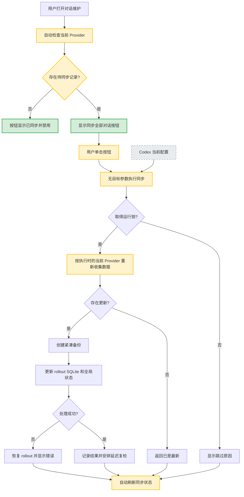

# 一键同步全部对话

> 所属模块：[dialog-sync](../../spec.md)
> 变更编号：001-one-click-dialog-sync
> 变更类型：enhance
> 创建日期：2026-07-13

## 1. 变更意图（Why）

当前界面把 Provider 归属、目标选择、影响预览和二次确认全部暴露给用户，但主要使用目标只是让同一台电脑上的历史对话统一出现在当前 Provider 下。该流程要求用户理解内部 Provider 元数据，增加了不必要的选择成本。本变更把同步收敛为单一按钮：执行时自动读取当前配置 Provider，并在一次点击内完成普通与归档对话同步。

## 2. 范围（What）

### 2.1 In Scope

- 对话同步区域只保留一个主要操作按钮，不再要求用户选择目标 Provider。
- 页面载入和同步完成后自动检查当前 Provider 下的待同步状态。
- 点击“同步全部对话”后立即执行，不显示影响预览步骤或二次确认。
- 同步命令不传目标参数，由后端在执行时读取当前 `config.toml` 的 Provider。
- 保留“检查中”“同步中”“已同步”、成功和失败等明确状态反馈。
- 保留现有 rollout、SQLite、全局状态、备份、运行锁、失败处理和诊断行为。
- 更新中英文用户文档、UI 预览数据和对话维护截图。

### 2.2 Out of Scope

- 不做应用启动、Provider 切换后的自动后台同步。
- 不改变 Codex 当前 Provider，不接管 ccSwitch、API Key 或模型通道管理。
- 不删除数据层和 Tauri 命令已有的显式 target 能力；它继续作为内部兼容接口存在。
- 不改变同步的数据范围、备份格式、备份保留数量、锁机制或诊断格式。
- 不增加 Provider Sync 备份恢复入口。
- 不修改回收站和会话 ZIP 导入导出流程。

### 2.3 涉及文件（预估）

- `apps/codex-pilot-manager/src/views/RecycleBinView.tsx`
- `apps/codex-pilot-manager/src/dialogSync.ts`
- `apps/codex-pilot-manager/src/dialogSync.test.ts`
- `apps/codex-pilot-manager/src/dev/mockSnapshots.ts`
- `apps/codex-pilot-manager/package.json`
- `README.md`
- `README.en.md`
- `docs/features.md`
- `docs/features.en.md`
- `docs/images/readme-dialog-maintenance.png`

### 2.4 流程图（变更后完整流程 + Delta 高亮）

> 移除：目标 Provider 选择与自定义输入 —— 同步目标固定为执行时的当前配置 Provider。
>
> 移除：“预览影响”手动操作 —— 页面自动检查状态，不再把预览作为执行前步骤。
>
> 移除：同步二次确认 —— 单击“同步全部对话”立即执行。

## 3. Spec Delta / 实现范围

### 3.A Spec Delta（enhance）

#### 3.A.1 ADDED（新增能力）

- **一键同步状态入口**：对话维护页根据自动检查结果展示“检查中”“同步全部对话”“同步中”或“已同步”，并在一次点击内完成当前 Provider 同步。位置：spec §3.2、§3.3、§3.5。

#### 3.A.2 MODIFIED（修改能力）

- **用户目标与使用场景**：
  - 旧：用户先查看目标差异、选择当前或自定义 Provider、预览后确认同步。
  - 新：用户只需在切换 Provider 后点击“同步全部对话”，系统自动把本机普通与归档历史对话统一到执行时的当前 Provider。
  - 位置：spec §2.2、§2.3。
- **目标 Provider 输入**：
  - 旧：管理器允许用户选择当前、已发现或自定义 Provider；自定义值需要格式校验。
  - 新：普通用户操作不提供目标输入；管理器调用同步命令时不传 target，由后端读取执行时的当前 Provider。内部显式 target 接口继续保留，不属于普通 UI。
  - 位置：spec §3.1。
- **管理器核心交互**：
  - 旧：目标变化后手动预览影响，首次点击进入二次确认，再次点击才执行。
  - 新：页面自动检查当前 Provider 的同步状态；有差异时单击按钮立即执行，无差异时显示禁用的“已同步”。
  - 位置：spec §3.3 第 3、4、13 条。
- **核心流程**：
  - 旧：检查选定目标 → 展示分布 → 更换目标或发起同步 → 二次确认 → 执行。
  - 新：自动检查当前 Provider → 展示按钮状态 → 单击后无 target 执行 → 自动刷新。
  - 位置：spec §3.5。
- **模块范围**：
  - 旧：包含当前、已发现和自定义目标选择、手动预览与显式二次确认。
  - 新：包含当前 Provider 自动解析、状态自动检查、单击执行与结果反馈；后台自动同步仍明确排除。
  - 位置：spec §5.1、§5.2。
- **验收语义**：
  - 旧：AC 覆盖默认/自定义目标预览、无效目标拒绝和二次确认执行。
  - 新：AC 覆盖无选择入口、执行时当前 Provider、单击直接执行、按钮状态、Provider 切换后再次手动同步和底层数据保护不变。
  - 位置：spec §6 AC-1 至 AC-4，并新增一键交互场景覆盖。

#### 3.A.3 REMOVED（移除能力）

- **普通用户自定义同步目标**：移除管理器中的 Provider 下拉框、自定义输入框及“选择预设”交互；内部兼容 API 不删除。位置：spec §3.1、§3.3、§5.1、§6 AC-2、AC-3。
- **手动影响预览步骤**：移除“预览影响”按钮及其作为同步前置步骤的产品语义；自动状态检查继续存在。位置：spec §2.2、§2.3、§3.3、§3.5。
- **同步二次确认**：移除首次点击后的确认状态、取消按钮和再次点击要求。位置：spec §3.3、§3.5、§6 AC-4。

## 4. 实施方案（How）

### 4.1 技术方案概述

管理器继续在对话维护页载入时调用 `provider_sync_snapshot`，但不再构造 target request，也不再维护目标选择、自定义输入、预览中或确认中状态。快照只用于显示当前 Provider、待同步数量、技术详情和按钮状态。

点击“同步全部对话”时，前端直接无参数调用 `sync_provider_sessions`。现有 Tauri 命令会走 `run_provider_sync`，在任务执行时读取当前配置 Provider，因此不依赖页面先前快照中的目标值。完成、跳过或失败后统一重新获取快照并刷新管理器状态。

底层 `run_provider_sync_with_target`、请求类型和输入校验保持不变，避免破坏内部调用与兼容能力。本次只改变普通用户入口及其文档语义。

### 4.2 外部/内部依赖

- 外部：Codex `~/.codex/config.toml` 中的当前 `model_provider`；Codex 本地会话格式和 SQLite 索引。
- 内部：`provider_sync_snapshot`、`sync_provider_sessions`、`run_provider_sync` 及既有备份、锁、回滚和诊断流程。
- UI：现有 React 状态管理、Lucide 图标、管理器消息与进度回调。

### 4.3 TODO 拆解

#### 核心逻辑 / Runtime

- [x] **TODO-S1: 固化当前 Provider 默认执行契约**
  - **描述**：确认无 target 的同步命令继续调用 `run_provider_sync` 并在执行时读取当前 Provider；保留显式 target 分支，不修改同步数据层行为。补充或调整测试以防无参数路径被后续重构破坏。
  - **涉及文件**：`apps/codex-pilot-manager/src-tauri/src/commands/session_sync.rs`、`crates/codex-pilot-data/src/provider_sync/mod.rs`
  - **依赖**：无
  - **验收标准**：自动化测试证明无 target 使用配置 Provider，显式 target 兼容路径仍可用，数据层既有同步测试通过。

#### 表现层 / Tooling

- [x] **TODO-C1: 建立一键同步状态模型测试**
  - **描述**：先提取最小纯函数状态模型并编写测试，覆盖未取得快照、有待同步、同步中、无待同步四种按钮状态，以及待同步数量计算。
  - **涉及文件**：`apps/codex-pilot-manager/src/dialogSync.ts`、`apps/codex-pilot-manager/src/dialogSync.test.ts`、`apps/codex-pilot-manager/package.json`
  - **依赖**：无
  - **验收标准**：管理器测试命令执行新增测试，并对四种状态和按钮文案作明确断言。
- [x] **TODO-C2: 简化对话维护同步界面**
  - **描述**：删除目标选择、自定义输入、“预览影响”和二次确认状态；接入一键状态模型。按钮有差异时显示“同步全部对话”，无差异时显示禁用的“已同步”，点击后无参数执行同步并在结束后刷新状态。
  - **涉及文件**：`apps/codex-pilot-manager/src/views/RecycleBinView.tsx`
  - **依赖**：TODO-C1、TODO-S1
  - **验收标准**：界面不存在 Provider 选择和预览/确认控件；一次点击只发起一次无 target 同步命令；执行中禁止重复点击；完成或失败后状态可恢复并刷新。
- [x] **TODO-C3: 更新预览数据并完成视觉验证**
  - **描述**：调整 UI preview 的同步消息和状态样例，在桌面与窄窗口检查同步区域布局、长 Provider 名称、加载/可执行/执行中/已同步状态，更新对话维护截图。
  - **涉及文件**：`apps/codex-pilot-manager/src/dev/mockSnapshots.ts`、`docs/images/readme-dialog-maintenance.png`
  - **依赖**：TODO-C2
  - **验收标准**：预览模式可展示新交互；截图与实际界面一致；按钮、状态和技术详情无重叠或文本溢出。

#### 共享 / 通用

- [x] **TODO-G1: 更新中英文用户文档**
  - **描述**：把“选择目标、预览、确认”的说明改为“自动读取当前 Provider、单击同步”；明确切换 Provider 后需要再次手动点击，且同步不会后台自动运行。
  - **涉及文件**：`README.md`、`README.en.md`、`docs/features.md`、`docs/features.en.md`
  - **依赖**：TODO-C2
  - **验收标准**：中英文文档语义一致，不再指导用户选择自定义目标或先预览影响。

### 4.4 依赖关系与执行顺序

- TODO-S1 与 TODO-C1 可并行。
- TODO-S1 + TODO-C1 → TODO-C2。
- TODO-C2 → TODO-C3 与 TODO-G1；TODO-C3、TODO-G1 可并行。

## 5. 验收标准（AC）

- **AC-1：无需选择目标**
  - **Given** 用户进入“对话维护”页面
  - **When** 对话同步区域完成初始检查
  - **Then** 页面不显示 Provider 下拉框、自定义输入框、“选择预设”或“预览影响”按钮，并以当前配置 Provider 作为状态目标
- **AC-2：单击直接同步**
  - **Given** 当前 Provider 下存在待同步的普通或归档历史会话
  - **When** 用户单击“同步全部对话”
  - **Then** 管理器不显示二次确认或取消步骤，立即发起一次不含 target 的同步命令
- **AC-3：执行时读取当前 Provider**
  - **Given** 页面快照生成后，外部工具改变了 `config.toml` 的当前 Provider
  - **When** 用户随后单击“同步全部对话”
  - **Then** 后端以执行时读取到的当前 Provider 为目标，不使用过期快照中的 Provider
- **AC-4：按钮状态明确**
  - **Given** 页面处于初始检查、有待同步、正在同步或无需同步状态
  - **When** 用户查看同步区域
  - **Then** 操作分别表现为不可执行的“检查中”、可执行的“同步全部对话”、不可重复执行的“同步中”或不可执行的“已同步”
- **AC-5：Provider 切换后手动跟随**
  - **Given** 用户切换到另一个 Provider 并使历史会话产生归属差异
  - **When** 管理器刷新状态且用户再次单击“同步全部对话”
  - **Then** 全部可处理的普通与归档历史会话归属跟随新的当前 Provider
- **AC-6：数据保护保持不变**
  - **Given** 一键同步需要修改本地数据
  - **When** 后端执行同步
  - **Then** 既有备份、排他锁、rollout/SQLite/global-state 更新、失败处理、备份保留和诊断流程继续生效
- **AC-7：失败可见且界面可恢复**
  - **Given** 同步命令返回跳过或失败信息
  - **When** 本次调用结束
  - **Then** 管理器显示结果、结束“同步中”状态并重新检查当前同步状态，用户可在问题解决后再次点击
- **AC-8：不引入自动同步**
  - **Given** 用户切换 Provider、保存配置、启动宿主或刷新页面
  - **When** 用户未点击“同步全部对话”
  - **Then** 模块只允许执行只读状态检查，不得自动改写历史会话

## 6. 测试标准

### 6.1 单元测试覆盖点

- 无 target 的命令路径使用配置文件中的当前 Provider。
- 显式 target 的内部兼容路径保持可用。
- 按钮状态模型覆盖无快照、待同步、同步中、已同步四种状态。
- rollout 与 SQLite 待同步数量的合计逻辑保持一致。
- 既有 Provider Sync 数据层测试继续覆盖 rollout、SQLite、全局状态、备份和运行锁。

### 6.2 集成 / 场景验证

- 使用 UI preview 打开对话维护页，确认没有目标选择、预览按钮和二次确认控件。
- 使用存在待同步记录的快照，单击一次按钮，确认只调用一次无 target 的 `sync_provider_sessions`。
- 使用无待同步记录的快照，确认按钮显示“已同步”且不可点击。
- 模拟同步成功、跳过和失败，确认进度结束、消息可见并重新检查状态。
- 在外部切换当前 Provider 后刷新管理器，确认按钮重新反映归属差异；单击后目标跟随新的当前 Provider。
- 在桌面和窄窗口验证长 Provider 名称、状态文案、按钮及技术详情不重叠、不溢出。

## 7. 影响评估

- **向后兼容**：用户界面行为有意简化；底层显式 target API 和数据格式保持兼容。
- **数据影响**：有。用户单击后仍会改写普通与归档 rollout、SQLite 和受支持全局状态；迁移与保护策略沿用既有同步备份。
- **依赖影响**：不修改 `launch-injection` spec，不改变 ccSwitch、启动注入、回收站或 ZIP 会话维护契约。
- **回滚策略**：代码层可恢复旧版目标选择与确认 UI；已经执行的数据同步使用既有 `backups_state/provider-sync/` 备份作为人工恢复依据。

## 8. 风险与缓解

| 风险 | 影响 | 缓解措施 |
|------|------|---------|
| 单击直接执行降低了误操作门槛 | 用户可能在不理解数据改写时触发同步 | 按钮文案明确为“同步全部对话”，区域持续展示当前 Provider 和影响状态，并保留自动备份 |
| 页面快照与执行时 Provider 不一致 | 用户看到的状态目标可能在点击前已变化 | 同步命令不传 target，执行时重新读取配置；完成后刷新快照并显示实际结果 |
| 移除自定义目标影响高级迁移 | 普通 UI 不再支持特殊迁移 | 保留后端显式 target API，未来如有真实需求可设计独立高级入口 |
| 缺少组件测试框架 | UI 行为回归难以完全自动捕获 | 提取纯状态模型做单元测试，并用 UI preview 完成场景和视觉验证 |
| 文档截图与界面不同步 | 用户仍按旧流程寻找目标选择和预览 | 同一 change 更新中英文文档与对话维护截图 |

## 9. 开放问题

无。
