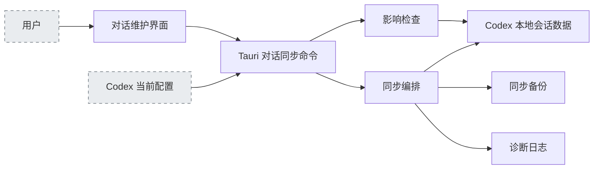
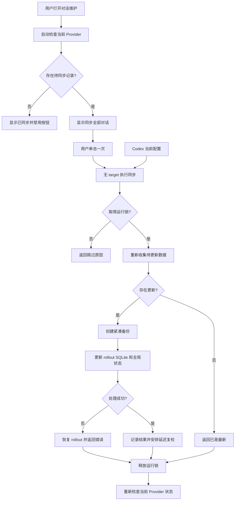

# 对话同步需求规格说明

> 状态：已确认（活文档，随 change 归档持续演化）
> 创建日期：2026-07-13
> 所属里程碑：无

## 1. 概述

### 1.1 模块简述

对话同步模块用于检查本机 Codex 会话的 Provider 归属差异，并在用户明确操作后，将普通与归档历史会话统一到指定 Provider。

### 1.2 所属系统

本模块横跨 CodexPilot 管理器的“对话维护”界面、Tauri 对话同步命令层，以及 `codex-pilot-data` 中负责本地会话文件、SQLite 索引、全局状态、备份和诊断的 Provider Sync 运行时。

### 1.3 关联文档

- `README.md`
- `docs/features.md`
- `docs/superpowers/specs/2026-05-20-provider-channel-simplification-design.md`
- `docs/development/provider-sync-split-mapping.md`
- `eo-doc/dev/launch-injection/spec.md`

### 1.4 模块架构图

## 2. 用户故事与场景

### 2.1 目标用户

在同一台电脑上通过 ccSwitch 或其他工具切换 Codex `model_provider`，并需要维护历史会话可见性和分组归属的 CodexPilot 用户。

### 2.2 用户故事

- 作为切换过 Provider 的用户，我希望只需点击一次“同步全部对话”，系统就把本机普通与归档历史会话统一到执行时的当前 Provider。
- 作为需要整理历史会话的用户，我希望页面自动展示当前 Provider 的待同步状态，并在无需同步时明确显示已对齐。
- 作为执行本地数据维护的用户，我希望同步前自动生成紧凑备份并留下诊断记录，以便发生异常时定位问题并保留恢复依据。

### 2.3 使用场景

1. 用户切换当前 Provider 后进入“对话维护”，系统自动读取当前配置并展示普通与归档 rollout 文件、SQLite 索引中的 Provider 分布及待同步数量。
2. 存在差异时，用户单击“同步全部对话”立即执行；系统在执行时重新读取当前 Provider，更新本机可处理数据并报告结果。
3. 同步任务已经运行、Codex home 不存在或本地数据处理失败时，系统不启动新的并发写入，并向用户返回可识别的跳过或失败信息。

## 3. 功能需求

### 3.1 输入

- **Codex home**：默认使用当前用户目录下的 `.codex`；测试或内部调用可以指定其他目录。
- **当前 Provider**：从 Codex home 下的 `config.toml` 根级 `model_provider` 读取；缺失、空值或无法解析时使用 `openai`。
- **目标 Provider**：普通用户入口不提供目标输入，管理器调用同步命令时不传 target，由后端在执行时读取当前 Provider。内部调用仍可显式提供目标；显式值去除首尾空白后必须非空、长度不超过 80 个字符，且仅包含 ASCII 字母、数字、下划线、中划线或点。
- **普通会话**：`sessions/` 下递归发现的 `rollout-*.jsonl` 文件。
- **归档会话**：`archived_sessions/` 下递归发现的 `rollout-*.jsonl` 文件。
- **会话索引**：Codex home 下的 `state_5.sqlite`。
- **全局状态**：Codex home 下的 `.codex-global-state.json`。

### 3.2 输出

- **检查快照**：目标 Provider、当前 Provider、可选 Provider、rollout 文件总数和待改数、SQLite 行总数和待改数，以及两类数据各自的 Provider 分布。
- **同步结果**：同步状态、结果消息、目标 Provider、备份目录、已改 rollout 文件数和已更新 SQLite Provider 行数。
- **本地数据更新**：符合条件的 rollout 首行会话元数据、SQLite thread 索引字段和受支持的全局工作区状态字段。
- **备份**：写入 `backups_state/provider-sync/` 的受管备份目录。
- **诊断事件**：写入 CodexPilot 诊断日志的同步前、提交后和延迟复检事件。
- **用户反馈**：管理器根据自动检查结果显示“检查中”“同步全部对话”“同步中”“已同步”或“重新检查”，并显示完成、跳过或失败信息。

### 3.3 核心行为描述

1. 检查流程递归读取普通与归档 rollout 文件，只把首行能够解析出会话元数据的文件纳入统计；无法解析或缺少 payload 的文件不参与同步。
2. 检查流程以目标 Provider 对比 rollout 首行的 `model_provider` 和 SQLite `threads.model_provider`，计算待同步数量及 Provider 分布，但不改写本地数据。
3. 管理器自动检查当前配置 Provider 的待同步状态，不向普通用户提供目标选择、自定义输入或手动影响预览控件。
4. 存在差异时，用户单击“同步全部对话”立即无 target 发起同步，不显示二次确认或取消步骤；无差异时显示禁用的“已同步”。
5. 同步流程取得排他运行锁后重新检查数据；若 Codex home 不存在或运行锁已存在，则跳过本次同步并返回原因。
6. 存在任何 rollout、SQLite 或全局状态更新时，同步流程先创建受管备份，再开始写入；若全部数据已经一致，则返回“已是最新”且不创建空备份。
7. rollout 更新只替换首行会话元数据中的 `model_provider`，保留文件剩余的对话事件内容不变。
8. SQLite 更新在事务中统一 `threads.model_provider`；当表包含对应字段时，还根据 rollout 数据补齐有用户事件的 thread 标记并规范 thread 工作区路径。
9. 全局状态更新只规范已支持的工作区根目录、项目顺序、活动工作区和工作区标签路径，保留其他未管理字段。
10. SQLite 或后续全局状态处理失败时，SQLite 自身事务保持其事务语义，已改写的 rollout 首行恢复为同步前内容；备份保留用于后续诊断或人工恢复。
11. 同步完成后保留最近五个由本模块管理的 Provider Sync 备份，不删除无法确认归属的其他目录。
12. 同步流程记录紧凑诊断信息，并在提交后延迟复检 SQLite Provider 差异，以区分同步失败与外部 Codex 进程回写。
13. 同步结束后释放运行锁，管理器重新读取当前 Provider 快照并在刷新完成后解除忙碌状态；页面挂载、重新获得焦点、恢复可见或用户手动刷新时也会执行只读检查。

### 3.4 业务规则与约束

- Provider Sync 必须由用户显式触发，不得因普通配置保存、应用启动或页面刷新而默认静默执行。
- 同步范围同时包含普通会话和归档会话，不包含回收站备份或外部导入包。
- 同步目标决定历史会话归属；本模块不切换 Codex 当前 Provider，也不管理 API Key 或 Provider 配置。
- 备份中的 rollout 信息只保存文件路径和原始首行元数据，不复制对话正文。
- 诊断信息不得包含对话正文、API Key、认证令牌或完整 rollout 内容。
- 同一 Codex home 同时最多运行一个同步任务。
- 不存在 `state_5.sqlite` 或目标表不含 `model_provider` 时，文件和其他可处理状态仍可按各自条件执行。
- 运行中的 Codex 进程可能在同步后重新写入索引；模块只记录延迟复检结果，不持续抢占或循环改写。

### 3.5 核心流程图 / 状态图

## 4. 非功能需求

### 4.1 性能要求

- 文件扫描、SQLite 访问、备份和写入不得阻塞 Tauri 主事件循环。
- 检查和同步只使用每个 rollout 的首行元数据判断 Provider 归属；备份不得复制完整对话正文。
- 同步任务完成后，延迟复检不得阻塞同步结果返回。

### 4.2 安全要求

- 所有读写限制在解析得到的 Codex home、CodexPilot 诊断目录和本模块受管备份目录内。
- 自定义 Provider 必须在命令边界完成格式校验。
- 数据写入前必须建立备份；备份 manifest 和诊断日志必须遵守最小数据原则。
- 清理备份时只删除能够通过受管元数据识别的旧 Provider Sync 备份。

### 4.3 兼容性要求

- 支持 Windows 与 macOS 的用户目录和工作区路径表现形式。
- 对缺失的会话目录、SQLite 文件、可选 SQLite 字段和全局状态字段进行兼容处理。
- 不改变 `codex_pilot_data::provider_sync` 已公开的检查、运行和结果模型访问路径。
- Codex 本地会话格式或 SQLite schema 发生变化时，无法识别的数据必须被跳过或明确报错，不得按未验证结构盲目写入。

## 5. 边界与限制

### 5.1 明确包含（In Scope）

- 普通与归档 rollout 会话的 Provider 归属检查和首行元数据同步。
- `state_5.sqlite` thread Provider、用户事件标记和工作区路径的一致性维护。
- `.codex-global-state.json` 中受支持工作区路径字段的规范化。
- 当前 Provider 自动解析、状态自动检查，以及内部显式 target 的兼容与校验。
- 单击执行、检查/同步/已同步/失败状态和结果反馈。
- 同步运行锁、紧凑备份、受管备份保留和诊断事件。

### 5.2 明确排除（Out of Scope）

- Provider 切换、Provider 配置编辑、API Key 或模型通道管理。
- 应用启动或 Provider 变化时的默认自动同步。
- 对话正文、消息内容或附件的迁移和修改。
- 回收站、会话 ZIP 导入导出及删除恢复流程。
- 跨电脑、云端或网络同步。
- 在管理器中提供 Provider Sync 备份恢复界面。
- 启动、CDP 连接和页面注入行为。

### 5.3 已知约束

- 会话能否显示和如何分组由外部 Codex 客户端解释 Provider 元数据的方式决定。
- 活跃 Codex 进程可能在同步完成后回写旧索引数据，本模块当前只通过延迟诊断识别该情况。
- 运行锁使用本地目录表达；进程异常终止后遗留的锁需要人工诊断和清理。
- rollout 只有首行是可识别会话元数据时才会被本模块处理。
- 备份提供恢复依据，但当前没有面向用户的一键恢复入口。

## 6. 验收标准（Acceptance Criteria）

### AC-1：无需选择目标

- **Given** 用户进入“对话维护”页面
- **When** 对话同步区域完成初始检查
- **Then** 页面不显示 Provider 下拉框、自定义输入框、“选择预设”或“预览影响”按钮，并以当前配置 Provider 作为状态目标

### AC-2：单击直接同步

- **Given** 当前 Provider 下存在待同步的普通或归档历史会话
- **When** 用户单击“同步全部对话”
- **Then** 管理器不显示二次确认或取消步骤，立即发起一次不含 target 的同步命令

### AC-3：执行时读取当前 Provider

- **Given** 页面快照生成后，外部工具改变了 `config.toml` 的当前 Provider
- **When** 用户随后单击“同步全部对话”
- **Then** 后端以执行时读取到的当前 Provider 为目标，不使用过期快照中的 Provider

### AC-4：按钮状态明确

- **Given** 页面处于初始检查、有待同步、正在同步、无需同步或检查失败状态
- **When** 用户查看同步区域
- **Then** 操作分别表现为不可执行的“检查中”、可执行的“同步全部对话”、不可重复执行的“同步中”、不可执行的“已同步”或可执行的“重新检查”

### AC-5：Provider 切换后手动跟随

- **Given** 用户切换到另一个 Provider 并使历史会话产生归属差异
- **When** 管理器在回焦、恢复可见或用户手动刷新时更新状态，且用户再次单击“同步全部对话”
- **Then** 全部可处理的普通与归档历史会话归属跟随执行时的新当前 Provider

### AC-6：数据最小化

- **Given** 同步涉及包含对话正文的 rollout 文件
- **When** 系统创建备份和诊断事件
- **Then** 备份 manifest 只包含路径和原始首行元数据，诊断不包含对话正文、API Key、认证令牌或完整 rollout 内容

### AC-7：无需更新

- **Given** rollout、SQLite 和受支持的全局状态已经与目标一致
- **When** 用户执行同步
- **Then** 系统返回“已是最新”、更新数为零，且不创建空备份

### AC-8：并发保护

- **Given** 同一 Codex home 已存在 Provider Sync 运行锁
- **When** 用户再次发起同步
- **Then** 新任务跳过执行并返回正在运行的原因，不修改本地数据

### AC-9：失败处理

- **Given** 同步在创建备份后发生本地数据处理错误
- **When** 任务结束
- **Then** 系统返回失败信息、保留备份、恢复已改写的 rollout 首行并释放由本次任务取得的运行锁

### AC-10：诊断复检

- **Given** 同步成功提交本地更新
- **When** 同步完成及延迟复检到期
- **Then** 诊断日志分别记录同步前分布、提交后剩余差异和延迟复检结果，用户无需等待延迟复检即可收到同步结果

### AC-11：范围隔离

- **Given** Codex home 同时包含回收站备份、会话 ZIP 或其他非 rollout 文件
- **When** 用户检查或执行 Provider Sync
- **Then** 系统只处理普通及归档目录中符合命名且首行可识别的 rollout 文件、目标 SQLite 索引和受支持全局状态字段

### AC-12：失败可见且界面可恢复

- **Given** 初始检查、同步命令或同步后的状态刷新返回失败
- **When** 本次调用结束
- **Then** 管理器显示失败信息、结束错误的忙碌状态，并允许用户在问题解决后重新检查或再次同步

### AC-13：不引入自动同步

- **Given** 用户切换 Provider、保存配置、启动宿主或刷新页面
- **When** 用户未点击“同步全部对话”
- **Then** 模块只执行只读状态检查，不自动改写历史会话

## 7. 开放问题（Open Questions）

无。

---

> **变更历史**：本模块的「关联变更」与「变更记录」见 [spec-history.md](spec-history.md)（与 spec.md 同目录）。
> 该文件由 eo-spec 在模块初始化时创建、由 eo-archive 在每次归档时自动追加。
