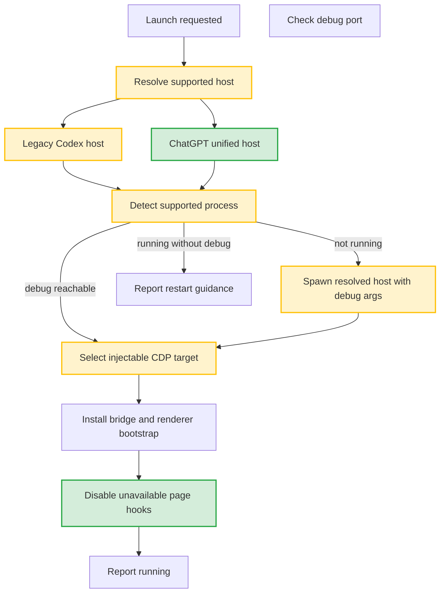

# Adapt launch and injection to ChatGPT unified desktop

> Module: [launch-injection](../../spec.md)
> Change ID: 001-chatgpt-unified-desktop-compat
> Change Type: enhance
> Created: 2026-07-13

## 1. Change Intent (Why)

OpenAI moved Codex into the new ChatGPT desktop app in July 2026. CodexPilot's launch path still assumes a standalone Codex desktop host, including Codex-specific app discovery, process detection, command preview, and CDP target preference. The change restores the launch and injection workflow for current users without dropping support for the legacy standalone Codex host.

## 2. Scope (What)

### 2.1 In Scope
- Add a host compatibility model that distinguishes legacy Codex and unified ChatGPT desktop hosts.
- Update app discovery and process detection to support both host families.
- Update launch command preview and launch execution to use the resolved host.
- Update CDP target selection to prefer Codex workflow pages inside ChatGPT while keeping legacy Codex selection.
- Add diagnostics that identify host kind, discovery source, selected CDP target, and graceful renderer degradation.
- Update manager launch labels and documentation language from single-app Codex assumptions to supported desktop hosts.

### 2.2 Out of Scope
- Provider profile behavior.
- Session sync and archive data schema changes.
- Full rewrite of `renderer-inject.js`.
- Revalidating or redesigning plugin unlock and Fast request rewriting beyond graceful disablement when hooks are unavailable.
- Any bypass of OpenAI account, entitlement, or workspace restrictions.

### 2.3 Estimated Files
- `crates/codex-pilot-core/src/app_paths.rs`
- `crates/codex-pilot-core/src/launcher.rs`
- `crates/codex-pilot-core/src/cdp.rs`
- `apps/codex-pilot-manager/src-tauri/src/launch_settings.rs`
- `apps/codex-pilot-manager/src-tauri/src/commands/launch.rs`
- `apps/codex-pilot-manager/src-tauri/src/commands/launch_helpers.rs`
- `apps/codex-pilot-manager/src-tauri/src/commands/diagnostics.rs`
- `apps/codex-pilot-manager/src/types.ts`
- `apps/codex-pilot-manager/src/autoLaunch.ts`
- `apps/codex-pilot-manager/src/main.tsx`
- `apps/codex-pilot-manager/src/views/LaunchView.tsx`
- `assets/inject/renderer-inject.js`
- `docs/features.md`
- `docs/features.en.md`
- `README.md`
- `README.en.md`

### 2.4 Flow Diagram

## 3. Spec Delta

### 3.A.1 ADDED
- **Unified ChatGPT host support**: The module supports the ChatGPT unified desktop host as a valid desktop host for Codex workflows. Location: spec 3.3.
- **Host kind diagnostics**: Launch diagnostics include resolved host kind and discovery source. Location: spec 3.2.
- **Renderer graceful degradation**: Page-specific enhancement hooks that are unavailable in the unified ChatGPT host are skipped or disabled while preserving the bridge. Location: spec 3.3.

### 3.A.2 MODIFIED
- **Desktop host discovery**
  - Old: Discovery assumes Codex-specific package names and executable names.
  - New: Discovery supports explicit paths, legacy Codex hosts, and unified ChatGPT hosts in deterministic priority order.
  - Location: spec 3.3.
- **Process detection**
  - Old: Running state assumes a `Codex` process.
  - New: Running state is based on supported host process names for the resolved host family.
  - Location: spec 3.3.
- **CDP target selection**
  - Old: Target selection prefers page targets whose title or URL contains `codex`.
  - New: Target selection scores legacy Codex targets and ChatGPT Codex workflow targets, with diagnostics for the selected target.
  - Location: spec 3.3.

### 3.A.3 REMOVED
- None.

## 4. Implementation Plan (How)

### 4.1 Technical Approach

Introduce a small host compatibility abstraction in the Rust core rather than replacing `Codex` strings across the codebase. The resolver should return both a path and a host kind, and downstream launch, process detection, command preview, diagnostics, and CDP target selection should consume that host kind.

Keep the first implementation focused on launch and bridge recovery. Renderer features that depend on ChatGPT internal modules or DOM details should report unavailable hooks instead of breaking the whole injection. That keeps the high-value path usable while later changes can revalidate Fast and plugin-specific behavior independently.

### 4.2 Dependencies
- External: current OpenAI desktop packaging and Chromium DevTools Protocol behavior.
- Internal: existing `windows_integration` subprocess helpers, launch preferences, helper runtime, CDP bridge installation, diagnostic log, and manager launch snapshot UI.

### 4.3 TODO Breakdown

#### Core Logic / Runtime

- [x] **TODO-S1: Add host compatibility model**
  - **Description**: Define supported host kind metadata for legacy Codex and unified ChatGPT, including display name, candidate app names, executable expectations, and process names.
  - **Files**: `crates/codex-pilot-core/src/app_paths.rs`, `crates/codex-pilot-core/src/launcher.rs`
  - **Dependencies**: None
  - **Acceptance**: Unit tests cover explicit path resolution, legacy discovery candidates, and ChatGPT discovery candidates.

- [x] **TODO-S2: Update process detection and launch command construction**
  - **Description**: Make running-state detection and command preview use supported host metadata instead of hard-coded Codex process names.
  - **Files**: `crates/codex-pilot-core/src/launcher.rs`, `apps/codex-pilot-manager/src-tauri/src/launch_settings.rs`
  - **Dependencies**: TODO-S1
  - **Acceptance**: Unit tests cover command construction for legacy Codex and ChatGPT host paths; Windows subprocess hygiene check remains clean.

- [x] **TODO-S3: Update CDP target selection**
  - **Description**: Replace the current simple `codex` contains check with a scoring function that supports legacy Codex pages and ChatGPT Codex workflow pages.
  - **Files**: `crates/codex-pilot-core/src/cdp.rs`
  - **Dependencies**: TODO-S1
  - **Acceptance**: Unit tests cover target preference for `/codex`, `chatgpt.com` Codex targets, legacy Codex targets, and no injectable target.

- [x] **TODO-S4: Add launch diagnostics for host compatibility**
  - **Description**: Emit host kind, discovery source, process detection result, selected target URL/title, and hook degradation events.
  - **Files**: `crates/codex-pilot-core/src/app_paths.rs`, `crates/codex-pilot-core/src/launcher.rs`, `crates/codex-pilot-core/src/cdp.rs`, `apps/codex-pilot-manager/src-tauri/src/commands/diagnostics.rs`, `assets/inject/renderer-inject.js`
  - **Dependencies**: TODO-S1, TODO-S3
  - **Acceptance**: Diagnostics distinguish app-not-found, process-running-without-debug, target-not-found, and renderer-hook-unavailable cases.

#### Presentation / Tooling

- [x] **TODO-C1: Update launch UI wording**
  - **Description**: Change launch labels, auto-launch messages, launch snapshot field naming, and hints from single Codex app assumptions to supported desktop host language while preserving user clarity.
  - **Files**: `apps/codex-pilot-manager/src/views/LaunchView.tsx`, `apps/codex-pilot-manager/src/autoLaunch.ts`, `apps/codex-pilot-manager/src/main.tsx`, `apps/codex-pilot-manager/src/types.ts`, `apps/codex-pilot-manager/src-tauri/src/commands/launch_helpers.rs`
  - **Dependencies**: TODO-S1
  - **Acceptance**: UI and auto-launch notifications show useful state for legacy Codex, ChatGPT host, unavailable host, reinject, and restart-required cases without misleading `codexInstalled` / `codexRunning` naming in newly touched contracts.

- [x] **TODO-C2: Update README and feature docs**
  - **Description**: Explain that CodexPilot now targets the ChatGPT desktop Codex workflow and still supports legacy Codex where present.
  - **Files**: `README.md`, `README.en.md`, `docs/features.md`, `docs/features.en.md`
  - **Dependencies**: TODO-S1 through TODO-S4
  - **Acceptance**: Docs no longer promise only standalone Codex app launch; compatibility limitations are explicit.

#### Shared / Common

- [x] **TODO-G1: Add manual verification checklist**
  - **Description**: Document exact manual checks for Windows and macOS host discovery, launch, reinjection, restart-required state, and renderer degradation.
  - **Files**: `docs/development/`
  - **Dependencies**: TODO-S1 through TODO-C2
  - **Acceptance**: Checklist can be followed on a current ChatGPT desktop installation without reading implementation code.

### 4.4 Dependencies And Execution Order

- TODO-S1 -> TODO-S2, TODO-S3
- TODO-S1 + TODO-S3 -> TODO-S4
- TODO-S1 -> TODO-C1
- TODO-S1 through TODO-S4 -> TODO-C2 and TODO-G1

## 5. Acceptance Criteria

- **AC-1**
  - Given legacy Codex is installed and ChatGPT is not installed
  - When the user launches from CodexPilot
  - Then the existing legacy Codex launch and injection path still works.
- **AC-2**
  - Given the unified ChatGPT desktop app is installed and not running
  - When the user launches from CodexPilot
  - Then CodexPilot starts ChatGPT with the configured debug port and attempts injection into a Codex workflow target.
- **AC-3**
  - Given ChatGPT is running without the configured debug port
  - When the launch snapshot is refreshed
  - Then the manager offers restart guidance instead of claiming direct injection is possible.
- **AC-4**
  - Given ChatGPT is running with the configured debug port
  - When the user chooses reinject
  - Then CodexPilot starts or reuses the helper and installs the bridge into the selected target.
- **AC-5**
  - Given a renderer enhancement hook no longer exists in ChatGPT
  - When injection completes
  - Then the missing hook is reported diagnostically and does not prevent bridge status, export entry points, or other available features from loading.

## 6. Test Criteria

### 6.1 Unit Test Coverage
- Host resolver candidate ordering and explicit path handling.
- Process detection command construction or parsing for supported process names.
- Launch command preview for legacy Codex and ChatGPT host paths.
- CDP target scoring and fallback behavior.
- Sanitization of launch preferences for supported host paths.

### 6.2 Integration / Scenario Verification
- Windows: fresh launch on current ChatGPT desktop installation.
- Windows: reinject into current ChatGPT desktop installation started with the debug port.
- Windows: detect current ChatGPT desktop installation running without the debug port.
- macOS: verify bundle discovery and launch command for current ChatGPT desktop installation.
- Legacy: verify existing Codex installation behavior remains unchanged where available.

## 7. Impact Assessment

- **Backward Compatibility**: Yes. Legacy Codex support must remain.
- **Data Impact**: No data migration expected.
- **Dependency Impact**: Launch, diagnostics, and injected renderer bootstrap are affected.
- **Rollback Strategy**: Keep legacy Codex resolution and launch code path intact; if ChatGPT support fails, users can configure an explicit legacy path or use manual launch plus reinjection where available.

## 8. Risks And Mitigations

| Risk | Impact | Mitigation |
|------|------|---------|
| Current ChatGPT package names differ by platform or release channel | Automatic discovery may fail | Support explicit path override and capture live package metadata in diagnostics |
| ChatGPT blocks or ignores remote debug arguments | Fresh launch may fail | Preserve manual/restart guidance and document verification steps |
| ChatGPT CDP targets do not expose stable Codex route metadata | Target selection may inject into the wrong page or fail | Use scoring with strict supported-domain checks and diagnostic target logging |
| Renderer hooks changed substantially | Some enhancements fail after bridge install | Degrade per enhancement and keep bridge status usable |

## 9. Open Questions

- What are the exact Windows install roots and executable names for the current ChatGPT desktop app?
- What are the exact macOS bundle names for the current ChatGPT desktop app?
- What URL/title metadata appears in CDP targets when ChatGPT is opened directly to Codex?
