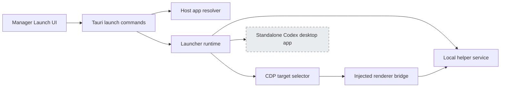
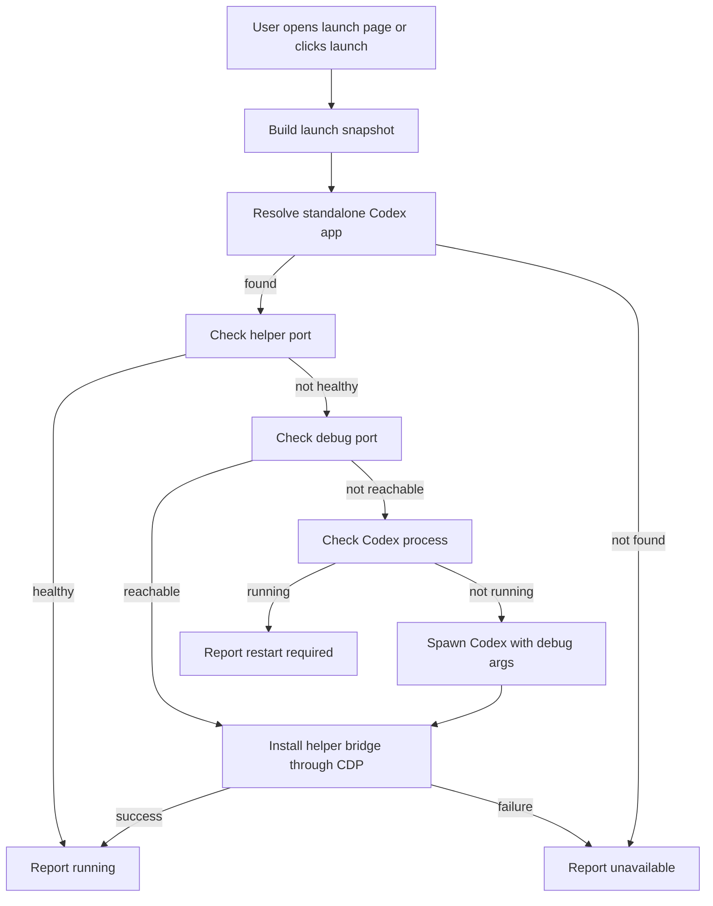

# Launch and Injection Requirements

> Status: confirmed
> Created: 2026-07-13
> Milestone: Baseline for launch and injection compatibility work

## 1. Overview

### 1.1 Module Summary
The launch-injection module owns the local workflow that finds the standalone Codex desktop host, starts it with a reachable Chromium DevTools Protocol port when needed, selects the Codex page target, starts the CodexPilot helper, and injects the renderer bridge.

### 1.2 Owning System
This module spans the Tauri manager launch commands, the Rust core launcher and CDP helpers, and the injected renderer bootstrap used by the CodexPilot desktop workflow.

### 1.3 Related Documents
- `README.md`
- `docs/features.md`
- `docs/contracts/subprocess.md`
- `docs/development/refactor-backlog.md`
- OpenAI Help Center: Moving to the new ChatGPT desktop app, published 2026-07-09

### 1.4 Module Structure Diagram

## 2. User Stories And Scenarios

### 2.1 Target Users
Users who run CodexPilot locally to manage and enhance their Codex workflow through the desktop application and local `.codex` data.

### 2.2 User Stories
- As a CodexPilot user, I want the manager to find the standalone Codex desktop app automatically so that I can start my Codex workflow without manually locating package internals.
- As a CodexPilot user, I want an already-running Codex app to be detected accurately so that the manager can offer reinjection or restart guidance instead of a broken launch.
- As a maintainer, I want launch and injection failures to be visible in diagnostics so that app path, process, debug port, and target-selection problems can be separated.

### 2.3 Usage Scenarios
- Fresh launch: no Codex process is running, the standalone Codex app exists, and the manager starts it with the configured debug port before injection.
- Reinjection: Codex is already running with a reachable debug port, and the manager injects the helper bridge without spawning another host process.
- Restart required: Codex is already running without a reachable debug port, and the manager reports that manual restart or restart-and-inject is required.

## 3. Functional Requirements

### 3.1 Inputs
- Optional user-configured desktop host path.
- Debug port and helper port preferences.
- Local process state for the standalone Codex desktop app.
- CDP target list from the configured debug port.
- Enhancement settings that determine which injected renderer features are enabled after bridge installation.

### 3.2 Outputs
- Launch snapshot for the manager UI, including resolved host path, process state, reachability, action kind, action label, detail text, and command preview.
- Running local helper service when injection succeeds.
- Renderer bridge and page enhancement bootstrap installed into the selected page target.
- Diagnostic events for launch, target selection, injection, timeout, and failure paths.

### 3.3 Core Behavior
- The module must support the standalone Codex desktop host.
- Automatic discovery must prefer explicit user-configured paths, then discover installed Codex app directories in deterministic priority order.
- Process detection assumes the desktop process is named `Codex` on macOS or `Codex.exe` on Windows.
- Command preview and spawn behavior must match the resolved Codex app path and platform.
- CDP page selection must choose a target that is compatible with CodexPilot injection, preferring page targets whose title or URL contains `codex`.
- If the helper port is already reachable and reports healthy status, the module must treat CodexPilot as running and avoid duplicate helper startup.
- If the debug port is reachable but helper is not running, the module must attempt reinjection.
- If a Codex process is running without a reachable debug port, the module must avoid blind injection and surface restart guidance.

### 3.4 Business Rules And Constraints
- Runtime subprocess calls must use `codex_pilot_core::windows_integration`.
- The module must not modify the installed OpenAI desktop application.
- The module must not require users to change `.codex/config.toml` to launch or inject.
- Diagnostic messages must distinguish app discovery failure, debug port reachability, CDP target selection, helper startup, and renderer injection failures.

### 3.5 Core Flow Diagram

## 4. Non-Functional Requirements

### 4.1 Performance Requirements
Launch snapshot polling must remain fast enough for the manager UI to refresh without visible stalls. Network checks against loopback ports must use short timeouts.

### 4.2 Security Requirements
Injection is limited to the locally selected desktop host page over a local CDP port. The helper service remains bound to loopback. The module must not expose local `.codex` data beyond existing CodexPilot helper routes.

### 4.3 Compatibility Requirements
The module must preserve macOS and Windows behavior for legacy Codex hosts while adding ChatGPT unified host support. Unsupported platforms must continue to fail with clear guidance.

## 5. Boundaries And Limits

### 5.1 In Scope
- Desktop host discovery and process detection.
- Launch command construction and preview.
- CDP target selection for standalone Codex workflow pages.
- Helper startup, reinjection, and launch state reporting.
- Renderer injection bootstrap.

### 5.2 Out of Scope
- Provider profile management.
- Session sync data model changes.
- Markdown or HTML export behavior.
- Reimplementing ChatGPT or Codex product internals.
- Bypassing OpenAI account, entitlement, or workspace access controls.
- Unified ChatGPT desktop host compatibility.

### 5.3 Known Constraints
- OpenAI desktop packaging and page structure can change without notice.
- Codex may move into a different desktop host, which requires a compatibility change outside the current baseline.
- Some renderer enhancements depend on private page structure and must be treated as best-effort.
- Existing local `.codex` storage format compatibility is handled outside this module.

## 6. Acceptance Criteria

- **AC-1**
  - Given a legacy Codex desktop host is installed and not running
  - When the user launches through CodexPilot
  - Then CodexPilot starts the legacy host with the configured debug port and injects successfully.
- **AC-2**
  - Given the standalone Codex app is already running with a reachable debug port
  - When the user chooses reinjection
  - Then the helper starts if needed and the bridge is installed into the selected Codex page.
- **AC-3**
  - Given a supported host is already running without a reachable debug port
  - When the manager builds the launch snapshot
  - Then the action state is restart guidance, not direct injection.
- **AC-4**
  - Given no standalone Codex app path can be resolved
  - When the manager builds the launch snapshot
  - Then the action state reports unavailable with app path guidance.

## 7. Open Questions

- None.

---

> Change history is tracked in [spec-history.md](spec-history.md).
